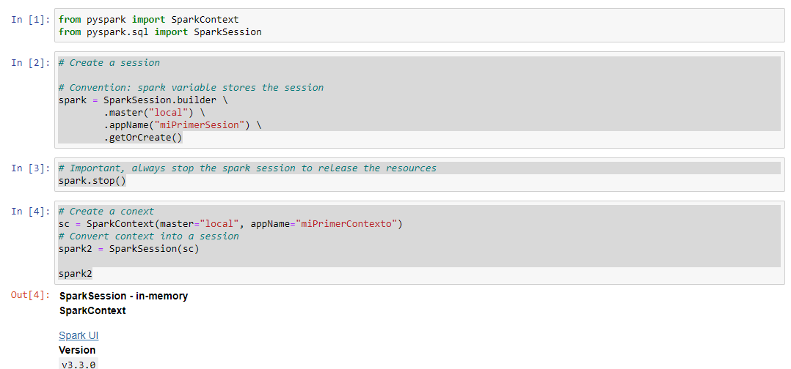

# Install Spark on Windows WSL 2 subsystem

## Requirements.

The only requirement is that you must be running version 2004 of Windows 10 and above to execute the following comands in PowerShell.

## Install WSL 2 subsystem

1. In an administrator PowerShell or Windows Command Prompt run the following command:

    wsl --install

2. Then restart your machine.

## Install Ubuntu Distro.

In Microsoft Store:
1. Search for Ubuntu 22.04.1 LTS
2. Click on Get
3. Click on Open

A window setup appears.

4. Select the language
5. Click Next

An Advance Setup Window appears.

    Type a Username.
    Type a Password.

Click on Setup button.

## Start your Ubuntu Distro.

1. Click on Start Menu
2. Search for Ubuntu 22.04.1
3. Click on Ubuntu 22.04.1
4. A terminal window is opened with the linux prompt.

Update your distro with this commands.

    $ sudo apt update
    $ sudo apt upgrade

## Install software requierements for Spark-3.3.0

### Install Java 11
Run this commands:

    $ sudo add-apt-repository ppa:openjdk-r/ppa
    $ sudo apt-get -y update 
    $ sudo apt-get -y upgrade
    $ sudo apt-get -y install openjdk-11-jre 

### Install Python 3.9
Run this commands:

    $ sudo add-apt-repository ppa:deadsnakes/ppa
    $ sudo apt update
    $ sudo apt install python3.9

### Install Scala
Run this commands:

    $ sudo apt-get -y install scala

### Install pip3 and py4j
Run this commands:

    $ sudo apt-get -y install python3-pip
    $ sudo pip3 install py4j

## Install Spark-3.3.0 and Hadoop3
Run this commands:
    
    * Download the tgz file
    $ wget https://dlcdn.apache.org/spark/spark-3.3.0/spark-3.3.0-bin-hadoop3.tgz
    * Unzip the tgz file
    $ tar -xvf  spark-3.3.0-bin-hadoop3.tgz
    * Rename spark-3.3.0-bin-hadoop3 to spark
    $ mv spark-3.3.0-bin-hadoop3 spark
    * Delete compressed file.
    $ rm spark-3.3.0-bin-hadoop3.tgz

## Install Anaconda
Run this commands

    * Download Anaconda
    $ wget https://repo.anaconda.com/archive/Anaconda3-2020.02-Linux-x86_64.sh
    * Install Anaconda
    $ sh Anaconda3-2020.02-Linux-x86_64.sh -b 
    * Update PATH variable
    $ export PATH=/home/$USER/anaconda3/bin:$PATH
    * Install conda py4j 
    $ conda install py4j

## Update .bashrc
Run nano command in your home directory and append the export sentences at the end of the file.

    $ sudo nano .bashrc

nano editor is opened. Paste the following lines.

    ## Path de Java
    export JAVA_HOME="/usr/lib/jvm/java-11-openjdk-amd64"
    export PATH=$JAVA_HOME:$PATH

    ## Spark
    export SPARK_HOME='/home/'$USER'/spark'
    export PATH=$SPARK_HOME:$PATH

    ## Python para ser utilizable por Spark
    export PYTHONPATH=$SPARK_HOME/python:$PYTHONPATH
    export PYSPARK_PYTHON=python3.9

    export PYSPARK_DRIVER_PYTHON="jupyter"
    export PYSPARK_DRIVER_PYTHON_OPTS="notebook"
    export PATH=/home/spark/anaconda3/bin:$PATH

Press ctl + o to save the file\
Press enter\
Press ctl + x to leave nano editor.

Reload the .bashrc

    $ source .bashrc

## Test Spark installation with spark-submit
Run the following commands to clone the following repo into Documents directory and test your instalation.

    $ git clone https://github.com/fmercado00/Spark-Installation-WSL.git Documents
    $ cd Documents
    $ ~/spark/bin/spark-submit codeExample.py data.csv

The previous test uses the spark-submit to run a python file with code that is available in the examples of Spark web site.

You shoud see a window with this result.

## Test Spark installation with jupyter notebook
In the Documents directory run:

    $ jupyter notebook

You should see that jupyter server has started, for example:

1. Switch to your windows operating system
2. Open a web browser
3. Copy and paste the http url of the jupyter server including the token
4. Add the following code to your notebook and run the cells to verify your installation is working.

Here is the code of the notebook.

    from pyspark import SparkContext
    from pyspark.sql import SparkSession

    # Creando una sesión

    # Convención la sesión la creamos con la variable Spark
    spark = SparkSession.builder \
            .master("local") \
            .appName("miPrimerSesion") \
            .getOrCreate()

    # Importante, siempre indicar a Spark que la sesión termina
    # de lo contrario consumiremos recursos locales y peor aun en nube
    spark.stop()